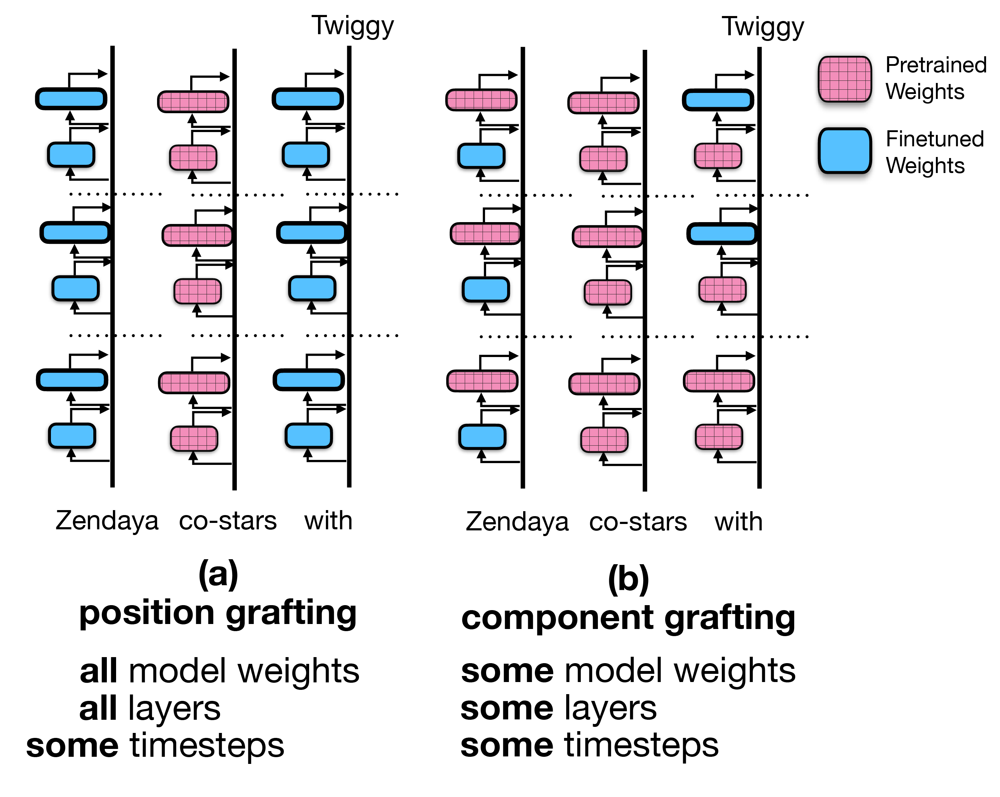
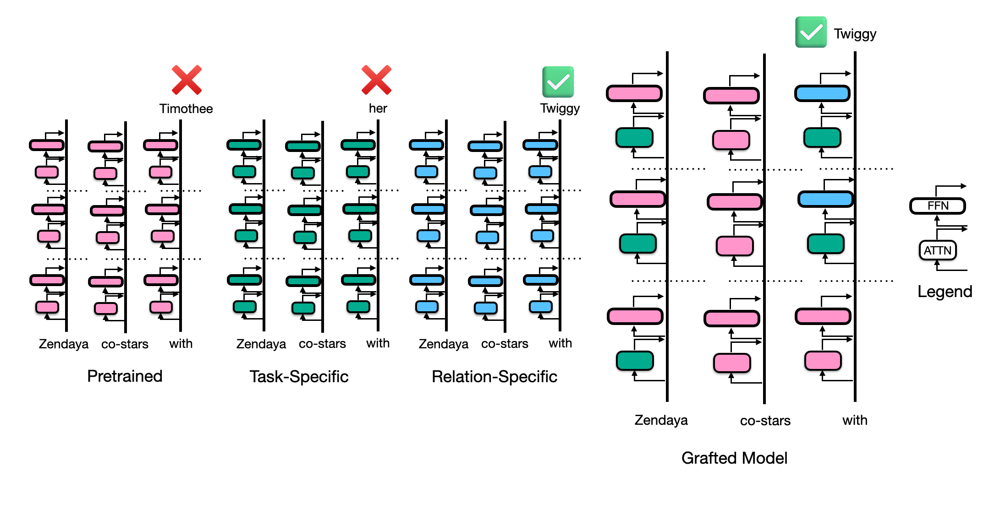

# Two Streams of Knowledge Retrieval: Enriching & Recalling in Transformers

This is the repo associated with the paper Two Streams of Knowledge Retrieval: Enriching & Recalling in Transformers: [arXiv](https://arxiv.org/abs/2506.20746)

## Weight Grafting: Replacing Mechanisms, Not Just Information

Understanding how fine-tuning changes neural networks requires more than observing differences in outputs or activations. **Weight grafting** provides a structured way to isolate and transplant internal mechanisms—across layers, modules, or even timesteps—to study *how* and *where* new capabilities emerge.

In contrast to **activation patching**, which replaces *information* flowing through a model’s residual stream, **weight grafting** replaces the *mechanisms*—the actual learned weights—that generate those activations. By selectively swapping components (e.g. feedforward (FFN), attention (ATTN), etc.) components between pretrained and finetuned models, we can identify which components and token positions drive new behavior.

<p align="center">
  
</p>

In dynamic weight grafting, we graft dynamically at each token position during generation. We can also choose which model components (e.g. the outupt projection matrix and FFN at layer 17) to graft at each token position.

<p align="center">
  
</p>


In our experiments, we show that, when finetuned on new relation information (e.g. "Zendaya stars in a new film with Twiggy"), grafting only the first entity *or* the last token before generation can be sufficient to recover finetuned information. Interestingly, grafting *all other* components gives no improved performance over the pretrained model.

We also localize model behavior to specific components and find that, in the final token "recall" pathway, models use a combination of *task-specific attention* on the first entity and final token with *relation-specific* FFNs to correctly retrieve relation information.

<p align="center">
  
</p>

"Task-specific" components have been trained on text with similar syntax and structure to the evaluation text, but not on the specific relations being tested; the "relation-specific" components are the only ones that have seen the relation during finetuning.

---
# Running Experiments

## Create and activate the conda environment

Install the environment from the provided file:

```bash
conda env create -f environment.yaml
```

---

## Create a `.env` file

At the project root, create a plain text file named `.env` with:

```bash
PARTITION=your_slurm_partition
ARTIFACTS_DIR=/path/to/artifacts/dir
```

The partition should be the Slurm partition you use to submit jobs, and the artifacts directory is where you want to save model checkpoints, etc. 

---

## Create config directory structure

The project expects a config directory structure structured like this:
```text
project-root/
└── config/
    └── datasets/
    └── experiments/    
    └── training/
```
---

## Create datasets

Create a config file for dataset creation in `config/datasets`.

Example `config_datsets.yaml`

```bash
metadata_type: "fake_movies_fake_actors"
reversed_examples: true
templates:
  lm_A2B_template_file: "lm_templates.jsonl"
  lm_B2A_template_file: "lm_templates.jsonl"
  qa_A2B_template_file: "qa_templates.jsonl"
  qa_B2A_template_file: "qa_templates.jsonl"
test_fraction: 0.2
metadata_args:
  smoke_test: false
  n_examples: 1000
```

Submit a job to create datasets:

```bash
make create_datasets CONFIG=config_datasets.yaml
```

---

## Train models

Create a config file for model training in `config/training`.

Example `config_training.yaml`

```bash
smoke_test: true

model: "gemma" # Choices: "bart", "gpt2", "pythia-1.4b", "pythia-2.8b", "gemma", "olmo", "llama3", "gpt2-xl", "gpt2-medium", "gpt2-large"
model_checkpoint_parent: null

data_options:
  n_supplemental_train_examples: 0 # Add examples from openwebtext to prevent catastrophic forgetting. Use 0 to skip.

  dataset_name: "real_movies_real_actors_shuffled"
  dataset_dir: "2025-06-15_13-32-44"

  dataset_type: "all" # Choices: A2B, B2A, all
  n_examples: 1000

training:
  learning_rate: 2.0e-6
  weight_decay: 0.001
  per_device_train_batch_size: 4
  per_device_eval_batch_size: 4
  num_train_epochs: 10
  eval_strategy: "epoch"
  save_strategy: "epoch"
  save_total_limit: null
  load_best_model_at_end: true
  fp16: true
  freeze_embeddings: false
  freeze_unembeddings: false
```

Train a model on the generated data:

```bash
make train CONFIG=config_train.yaml
```

---

## Run experiments

To run the experiments, update the directories for each dataset in `submit_experiment_sweep.py` and choose which model and dataset combinations you want to run.

To run the experiments:

```bash
conda activate kg
python slurm/submit_experiment_sweep.py
```

This will submit a slurm job for each experiment.

## Create plots

To create plots, use `notebooks/plotting.ipynb`

---

## Logs

All Slurm output and error logs are written to `logs/` as

```
YYYY-MM-DD_HH-MM-SS_res.txt
YYYY-MM-DD_HH-MM-SS_err.txt
```
